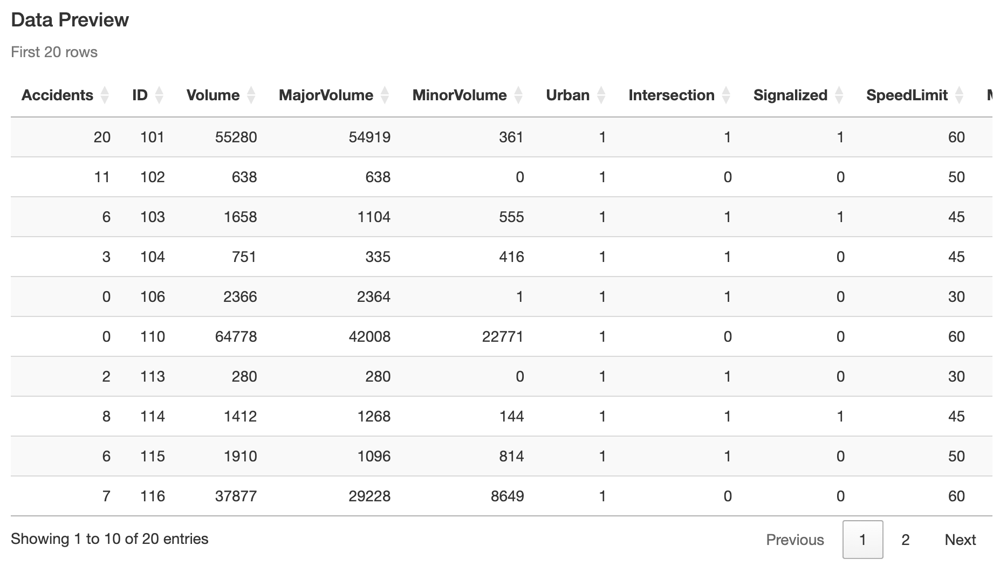
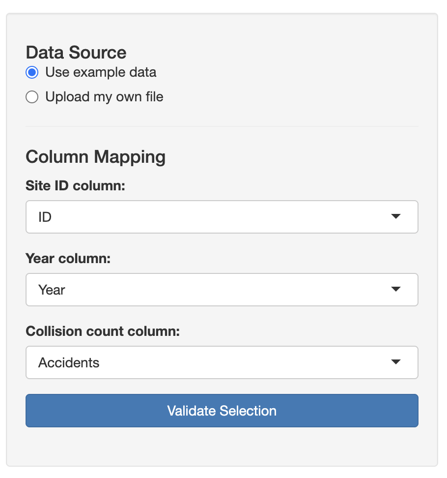
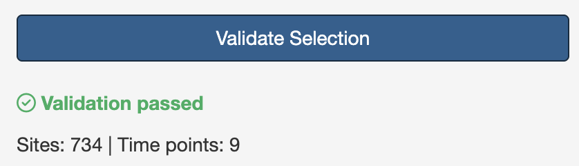
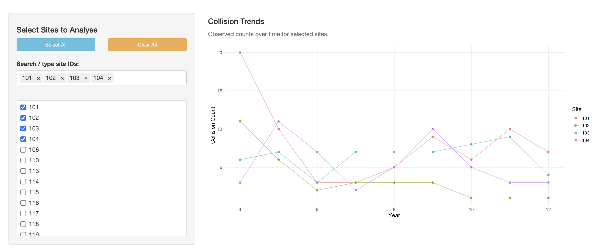
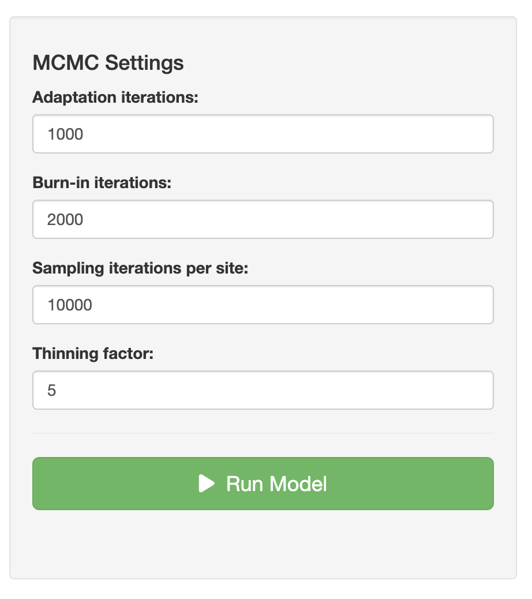
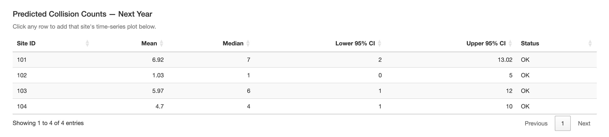
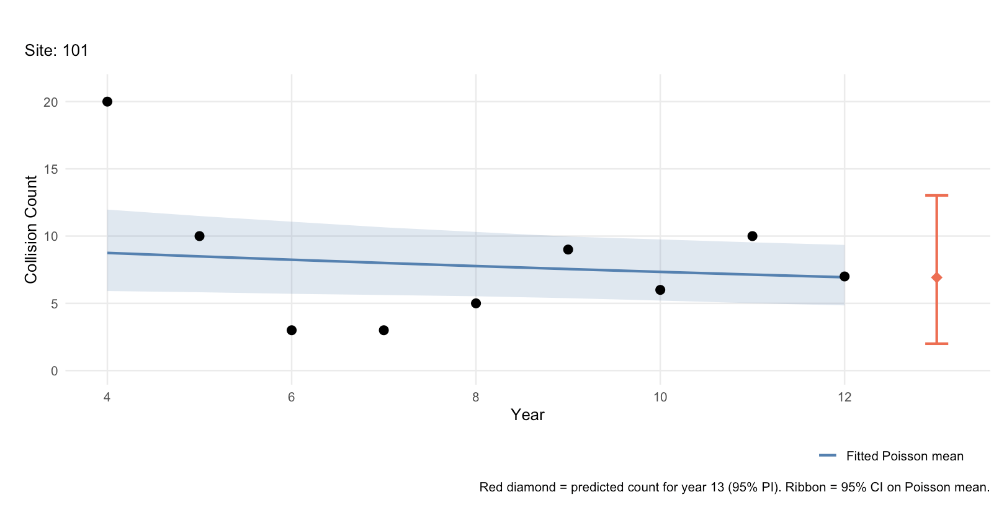
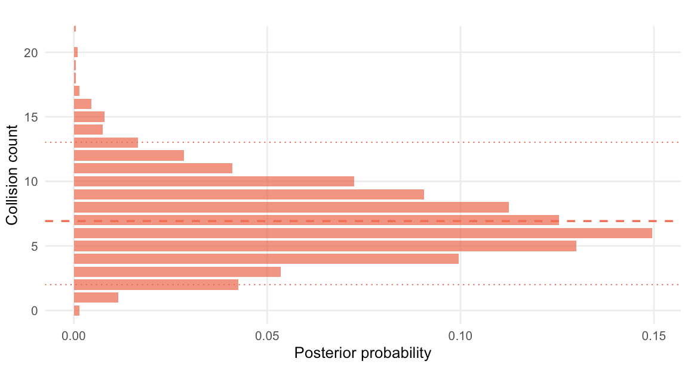
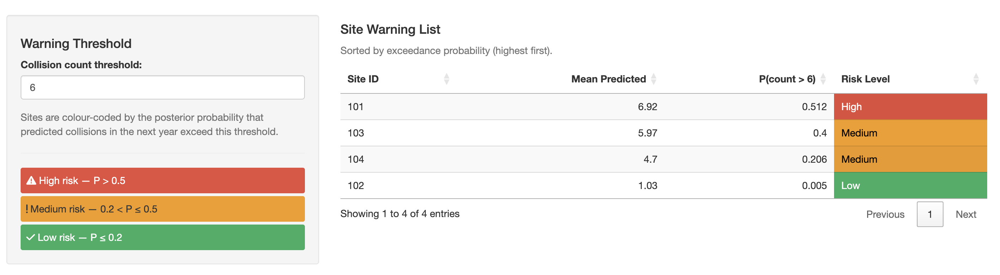

## Introduction

This guide describes how to use the RAPTOR Hotspot Prediction app, which is available [here](https://joematthews-raptorhotspot.share.connect.posit.cloud). It is developed and maintained by [Joe Matthews](mailto:joe.matthews@ncl.ac.uk) and [Lee Fawcett](mailto:lee.fawcett@ncl.ac.uk) from Newcastle University. The underpinning research methodology is described in [this paper](https://www.mas.ncl.ac.uk/~nlf8/publications/AAP.pdf).

### Who Can Use the RAPTOR Apps?

The RAPTOR apps are free for use by anyone, and are designed to allow road safety practitioners to implement statistical methods developed by the team at Newcastle University to support their decision making. As an academic institution, we are required to pursue research impact (i.e. the application of research methods which makes a notable difference to society and business), and as such we would greatly appreciate it if you would keep us informed of any cases where the RAPTOR apps have been used (in any way) as part of any decision making process.

### What is the Hotspot Prediction App?

The Hotspot Prediction app uses statistical modelling to estimate collision/casualty counts at different locations over time, and to provide forecasts (with corresponding probability estimates) of future counts at those locations. These estimates are made from a combination of site-level information (e.g. speed limit, road class, traffic flow) as well as local and global trends over time. The app is designed to assist practitioners in identifying high-risk locations on their network, with a view to potentially deploying an appropriate road safety countermeasure.

::: callout-warning
This app is not intended to be, and should never be used as, the sole decision-making criterion for where treatments are deployed. It is intended to assist practitioners in processing large volumes of data and provide a data-informed basis for decision making, but should never overrule the expertise and local knowledge of road safety practitioners.
:::

### App Structure

The app is broken down into 6 sections, accessible by buttons at the top of the screen:

| Section | Description |
|------------------------------------|------------------------------------|
| **Introduction** | Summary of the app and outline data requirements |
| **Data Upload** | Upload data for analysis and identify the relevant columns |
| **Site Selection** | Choose which sites (or all of them) to include in the analysis |
| **Simulation Settings** | Configure model settings (defaults are suitable for most cases) |
| **Results** | Graphical and tabular results showing collision rate trends and forecasts |
| **Site Warnings** | Predicted probability of each site exceeding a user-defined count threshold |

## Data Upload

In the Data Upload tab, the user can either upload their own data or use the built-in example dataset. When using the app for the first time, it is recommended to use the example dataset to understand the app's functionality and required data format.

### Data Requirements

The Hotspot app requires a single data file (`.csv` or `.txt`) containing data on a number of sites (potential hotspots) across a number of years. Each row should correspond to one site in one year, so the total number of rows equals the number of sites multiplied by the number of years of data.

Each row should contain:

- A site ID variable
- The year in question
- The collision/casualty count for that year
- Descriptor information about the site (e.g. speed limit, average speed, traffic flow, road class)

{height="200"}

### Column Mapping

Once a data file has been selected, it is previewed on the right-hand side of the screen. If uploading your own file, this is an opportunity to check the file has been formatted correctly (e.g. the expected number of columns are present and data is not missing). It may be necessary to adjust the **Column Separator** dropdown if columns are not separated as expected.

{height="200"}

Once the data looks as expected, complete the **Column Mapping** inputs to specify which columns correspond to the site `ID`, `Year`, and collision/casualty `Count`. Then click **Validate Selection**, which checks for missing values or incorrectly formatted data and confirms the number of sites and years in the data.

{height="100"}

Once validation is complete, proceed to the next tab.

## Site Selection

The **Site Selection** tab allows you to choose which sites from the uploaded data to include in the analysis. Sites are listed by the IDs identified on the Data Upload tab. By default all sites are selected, though the analysis will take longer the more sites are included (for the 734 sites in the example dataset, a full run with default settings takes around 5 minutes).

The plot on the right displays the counts over time for the currently selected sites.

{height="200"}

Once the desired sites have been selected, proceed to the next tab.

## Simulation Settings

The **Simulation Settings** tab allows you to configure the model. In the vast majority of cases these settings can be left at their defaults.

{height="200"}

Click **Run Model** to start the analysis. Once the model has finished running, proceed to the Results tab.

## Results

The **Results** tab presents a summary table of predicted counts for the following year. Each row corresponds to a different site and shows:

- **Mean** and **Median** — the average predicted count at the site
- **Lower 95% CI** and **Upper 95% CI** — the range the model is 95% confident will contain the next count

{height="200"}

Clicking on a row displays a plot showing the counts at that site over time (black dots), the modelled trend (blue line) with 95% confidence band (blue shaded region), and the predicted count (orange diamond) with its 95% prediction interval (orange bar).

{height="200"}

On the right-hand side, a bar chart shows the predictive probability of observing each possible number of collisions in the next time period, providing a fuller picture of likely outcomes beyond a single-number prediction.

{height="200"}

## Site Warnings

The **Site Warnings** tab provides an alternative way of interpreting the predicted collision counts.

On the left, enter a count threshold — the number of collisions beyond which a site would be considered a hotspot. On the right, a table ranks all analysed sites by their estimated probability of exceeding that threshold. The table shows the average predicted count at each site, the estimated exceedance probability, and a colour-coded risk rating.

{height="200"}
